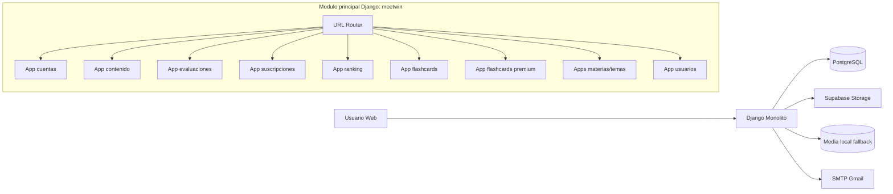
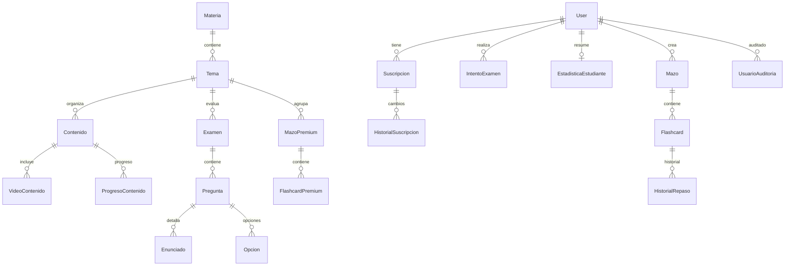
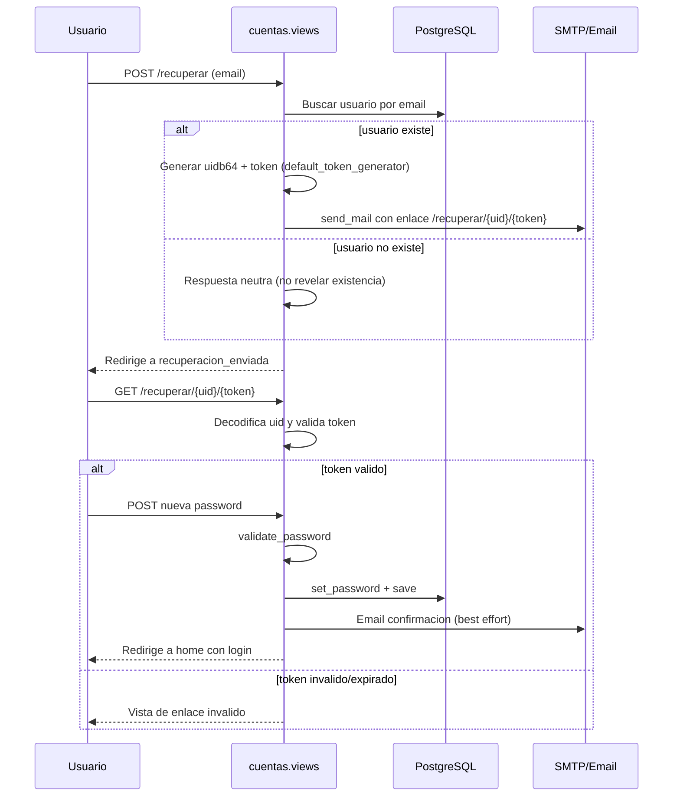
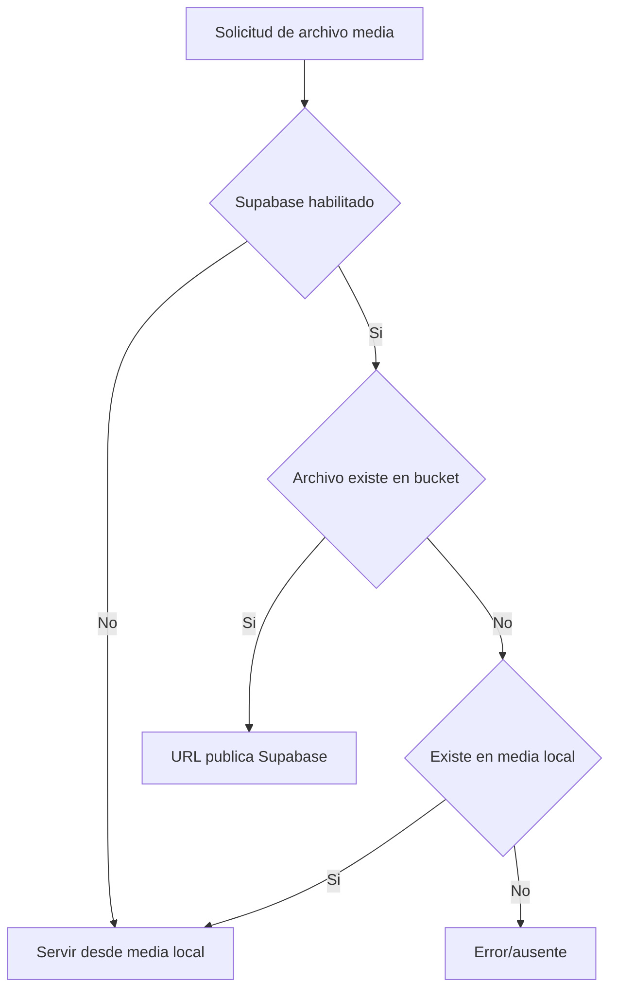

# Informe tecnico del proyecto AprendoYa

## 1. Resumen ejecutivo
Sistema web educativo construido sobre Django para gestionar:
- autenticacion y roles (admin/estudiante),
- biblioteca de contenidos secuenciales,
- evaluaciones y ranking,
- suscripciones premium con comprobantes y QR,
- flashcards regulares y premium.

La arquitectura sigue un estilo monolitico modular por apps Django.
El nombre funcional del sistema es AprendoYa y el modulo principal Django se llama meetwin.

## 2. Tecnologias usadas
## Backend
- Python 3.11
- Django 5.1.1
- PostgreSQL (por configuracion principal)
- Supabase Storage (archivos/media)
- Fallback local de archivos con FileSystemStorage
- python-dotenv (variables de entorno)
- Pillow (manejo de imagenes)

## Librerias declaradas
Archivo: requirements.txt
- Django==5.1.1
- psycopg2-binary==2.9.9
- python-dotenv==1.0.0
- supabase==2.4.5
- Pillow==10.1.0
- djangorestframework==3.14.0

Nota: el proyecto expone APIs via JsonResponse nativo de Django; no se observa uso directo de DRF en vistas actuales.

## Frontend
- Templates Django (HTML server-rendered)
- CSS y JS vanilla (sin framework frontend)
- Font Awesome para iconografia

## Email
- SMTP Gmail en produccion/configuracion real
- console backend cuando no hay credenciales

## 3. Arquitectura general
## Patron de arquitectura aplicado
El sistema usa el patron de Django conocido como MVT (Modelo - Vista - Template):
- Modelo: clases en models.py con ORM de Django para mapear tablas relacionales.
- Vista: funciones en views.py que contienen reglas de negocio, validaciones y respuestas HTML/JSON.
- Template: archivos HTML en templates/ para renderizado del frontend del lado servidor.

En la practica, este MVT cubre lo que comunmente se llama MVC en otros frameworks.

## Estructura modular por apps
- apps.cuentas: autenticacion, registro, verificacion de correo, recuperacion de password, perfil, panel por rol.
- apps.usuarios: administracion/auditoria de usuarios.
- apps.materias_nueva y apps.temas: catalogo academico.
- apps.contenido: contenidos y progreso de aprendizaje con reglas de desbloqueo.
- apps.evaluaciones: examenes, preguntas, intentos y calificacion.
- apps.ranking: estadisticas agregadas y ranking.
- apps.suscripciones: flujo premium, QR, comprobantes y aprobacion admin.
- apps.flashcards: mazos personales y repeticion espaciada.
- apps.flashcards_premium: mazos premium ligados a tema y suscripcion.

## Diagrama de arquitectura (alto nivel)

## 4. Base de datos
## Tipo de base de datos
Configuracion principal:
- Motor: django.db.backends.postgresql
- Driver: psycopg2-binary

## Enfoque relacional
La base de datos es relacional (PostgreSQL) y el proyecto usa relaciones:
- OneToOne: ejemplo User -> EstadisticaEstudiante.
- ForeignKey: ejemplo Tema -> Materia, Examen -> Tema, Suscripcion -> User.
- Restricciones: unique_together en varios modelos para consistencia.
- Integridad referencial gestionada por el ORM de Django.

Archivo de referencia:
- meetwin/settings.py

Observacion:
- Existe db.sqlite3 en el workspace, pero la configuracion activa en settings apunta a PostgreSQL.

## Modelo de datos (simplificado)

## 5. Flujo funcional del sistema
## Flujo academico principal
1. Admin define Materias y Temas.
2. Admin publica Contenidos y Examenes.
3. Estudiante consume Contenido con desbloqueo secuencial.
4. Estudiante rinde Examen del tema.
5. Se registra IntentoExamen y se actualiza ranking/estadisticas.
6. Si el contenido es premium, se valida Suscripcion activa.

## Regla de desbloqueo relevante
En contenido:
- El primer contenido de un tema requiere aprobar examen del tema anterior (si aplica).
- Dentro del tema, cada contenido exige completar el contenido previo.

## 6. Recuperacion de contrasena: como funciona y librerias
## Importante
Actualmente NO usa codigo numerico OTP.
Usa enlace con uid + token firmado de Django.

## Librerias/modulos usados en este flujo
- django.contrib.auth.tokens.default_token_generator
- django.utils.http.urlsafe_base64_encode / urlsafe_base64_decode
- django.utils.encoding.force_bytes
- django.core.mail.send_mail
- django.contrib.auth.password_validation.validate_password
- django.contrib.messages (feedback UI)
- django.urls.reverse (armado de URL de recuperacion)

## Secuencia del flujo de recuperacion

## 7. Almacenamiento de imagenes/media
Configuracion hibrida:
- Primario: Supabase Storage (bucket media).
- Fallback: media local cuando Supabase no esta disponible.

Comportamiento relevante:
- Si no hay conectividad/credenciales validas, el backend cambia a FileSystemStorage local.
- Si un archivo no existe en Supabase pero si en local, el storage devuelve URL local /media/...

## Diagrama de almacenamiento

## 8. Endpoints principales por modulo
- / : home y autenticacion base (apps.cuentas)
- /contenido/biblioteca/ : biblioteca de contenido
- /examenes/ y /examenes/disponibles/ : evaluaciones
- /suscripciones/ : estado premium y carga de comprobante
- /flashcards/ : mazos regulares
- /flashcards-premium/ : mazos premium
- /ranking/ : ranking general

## 9. Observaciones tecnicas y recomendaciones
1. Seguridad: .env.example contiene secretos reales (keys/tokens). Deben rotarse y reemplazarse por placeholders inmediatamente.
2. DRF: esta en requirements pero no se usa de forma explicita; decidir si mantenerlo o removerlo.
3. README: parece guardado con codificacion UTF-16 LE; conviene convertir a UTF-8 para edicion/lectura estandar.
4. Base de datos: validar coherencia entre uso de PostgreSQL y presencia de db.sqlite3 para evitar confusiones de entorno.

## 10. Herramientas usadas en el proyecto
## Frameworks y servicios
- Django (framework web principal)
- PostgreSQL (motor de base de datos relacional)
- Supabase Storage (media en la nube)
- SMTP Gmail (envio de correos)

## Herramientas/librerias de desarrollo
- ORM y migraciones de Django (manage.py makemigrations/migrate)
- python-dotenv para configuracion por entorno
- psycopg2-binary para conexion PostgreSQL
- Pillow para manejo de imagenes
- Git para control de versiones (flujo recomendado)

## 11. Archivos clave revisados
- meetwin/settings.py
- meetwin/urls.py
- meetwin/supabase_storage.py
- apps/cuentas/views.py
- apps/cuentas/models.py
- apps/cuentas/urls.py
- apps/contenido/models.py
- apps/evaluaciones/models.py
- apps/suscripciones/models.py
- apps/ranking/models.py
- apps/flashcards/models.py
- apps/flashcards_premium/models.py
- apps/materias_nueva/models.py
- apps/temas/models.py
- requirements.txt
- .env.example
